<!--
  GitHub Profile README for Gnanesh-12
  Repo: github.com/Gnanesh-12/Gnanesh-12
  Assets generated by scripts/ — see below for details.
-->
<div align="center">


[](https://git.io/typing-svg)

<br>

[](https://github.com/Gnanesh-12?tab=followers)
[](https://github.com/Gnanesh-12)
[](https://github.com/Gnanesh-12)
[](https://github.com/Gnanesh-12?tab=repositories)

</div>

---

<!-- ═══════════════════ ASCII PORTRAIT + INFO CARD ═══════════════════ -->

<div align="center">

<table>
<tr>
<td valign="top"></td>
<td valign="top"></td>
</tr>
</table>

> 🎨 *Portrait & info card are auto-generated SVGs — [see how they're built](#-how-the-profile-art-works)*

</div>

---

## 🧑‍💻 About Me

```javascript
const gnanesh = {
  name:         "KHANDAVILLI V V S D GNANESH",
  role:         ["AI/ML Engineer", "Full-Stack Developer", "Embedded Systems Engineer"],
  location:     "📍 Hyderabad, India",
  education:    "🎓 Final-year B.Tech CSE @ Amrita Vishwa Vidyapeetham '27",
  experience:   "💼 AI & Data Ops Intern @ BuzzBrain",
  email:        "📧 gnaneshkhandavilli@gmail.com",

  techStack: {
    languages:   ["Python", "JavaScript", "Java", "C/C++", "Dart", "HTML/CSS"],
    ai_ml:       ["TensorFlow", "Flower (FL)", "scikit-learn", "YOLOv8", "CSRNet",
                  "Computer Vision", "Pose Estimation", "Classification Models"],
    frontend:    ["React", "Flutter", "HTML5", "CSS3"],
    backend:     ["Flask", "FastAPI", "Node.js", "PostgreSQL", "MongoDB", "REST APIs"],
    embedded:    ["STM32", "Arduino", "MAX30102", "RTOS"],
    devOps:      ["Docker", "GitHub Actions", "CI/CD Pipelines", "Jest"],
    cloud:       ["Edge-Fog-Cloud Architecture", "Vercel"],
    bigData:     ["Apache Hadoop", "Apache ZooKeeper", "HDFS"],
    blockchain:  ["Smart Contracts", "Cryptography", "Audit Trails"]
  },

  currentFocus: ["🧠 Federated Learning (AQI forecasting)",
                 "👤 Head Detection & Counting (YOLOv8n → CSRNet)",
                 "🗳️ Blockchain E-Voting Prototype"],
  openToWork:   true,
  funFact:      "I write code for both microcontrollers AND production web apps 🔌📱"
};
```

> 🔥 Hi, I'm **Gnanesh Khandavilli** — an AI/ML engineer and full-stack developer with hands-on experience in **federated learning**, **computer vision**, and **edge-fog-cloud architectures**. I'm equally comfortable training a YOLOv8 model, shipping a React app, or flashing firmware onto an STM32. Currently wrapping up my final-year capstone on **federated AQI forecasting** while interning at **BuzzBrain** on AI & Data Ops.

---

## 🛠️ Tech Stack & Tools

<div align="center">

### 💬 Languages


### 🤖 AI / ML & Data Science


### 🧩 Frameworks & Platforms


### 🗄️ Databases


### ⚙️ DevOps, Cloud & Big Data


### 🔧 Hardware & Embedded


</div>

---

## 🚀 Featured Projects

<div align="center">

| 🏆 Project | 🔧 Tech Stack | 📄 Description |
|:---|:---|:---|
| 🧠 **Federated AQI Forecasting** | Python · Flower · TensorFlow · Edge-Fog-Cloud | Final-year capstone: federated learning for air quality index prediction across distributed edge nodes |
| 👤 **Head Detection & Counting** | Python · YOLOv8n · CSRNet · OpenCV | Real-time head detection pipeline migrating from YOLOv8n to CSRNet for dense crowd counting |
| 🗳️ [**E-Voting System Prototype**](https://github.com/Gnanesh-12) | Blockchain · Cryptography · Node.js · PostgreSQL | End-to-end encrypted blockchain-based voting workflow with automated E2E test coverage |
| 🧘 [**AtmaYoga — AI Pose Classifier**](https://github.com/Gnanesh-12) | Python · Computer Vision · CI/CD | Real-time yoga pose estimation system with automated testing, CI/CD pipeline, and coverage reporting |
| 💛 [**Digital Gold & Silver Platform**](https://github.com/Gnanesh-12/DIGITAL---GOLD-SILVER) | JavaScript · React · Node.js | Full-stack digital marketplace for gold & silver trading with live price tracking and multi-role dashboard |
| 🍽️ [**Flutter Canteen Management**](https://github.com/Gnanesh-12/flutter_Canteen_Management_App) | Flutter · Dart · Mobile | Cross-platform canteen management system — menus, orders, and payments with production-quality mobile UI ⭐ 1 |
| 💓 [**Heart Rate & SpO₂ Monitor**](https://github.com/Gnanesh-12/Heart-Rate-and-SpO-Monitoring-System-using-STM32-and-MAX30102) | C · STM32 · MAX30102 · Embedded | Real-time biomedical monitoring using STM32 + MAX30102 sensor for heart rate & blood oxygen tracking |
| 🐍 [**Snake Game on Arduino**](https://github.com/Gnanesh-12/Snake_Game_Arduino) | C++ · Arduino · Electronics | Classic Snake game on Arduino with LED matrix — firmware-level game loop and timing precision |
| 🌐 [**Zookeeper-HDFS Integration**](https://github.com/Gnanesh-12/Zookeeper-HDFS) | Python · Hadoop · ZooKeeper | Distributed systems: Apache ZooKeeper coordination + HDFS fault-tolerant data storage |

</div>

---

## 📊 GitHub Statistics

<div align="center">


</div>

<div align="center">


</div>

---

## 📈 Contribution Activity

<div align="center">

<!-- animated contribution heatmap, refreshed daily by the GitHub Actions workflow -->


<br><br>

[](https://github.com/ashutosh00710/github-readme-activity-graph)

</div>

---

## 🎯 What I'm Currently Working On

- 🧠 **Federated AQI Forecasting** — capstone project: edge-fog-cloud federated learning for air quality prediction
- 👤 **Head Detection & Counting** — migrating from YOLOv8n to CSRNet for dense crowd analysis
- 🗳️ **E-Voting System** — building out end-to-end test automation and CI/CD
- 🧘 **AtmaYoga** — improving model accuracy and expanding GitHub Actions coverage
- 💼 **AI & Data Ops @ BuzzBrain** — internship focused on data pipelines and ML ops
- 🌐 **My Portfolio** — live and continuously updated → [**Live Portfolio** 🔗](https://my-portfolio-ashen-one-ezi2xpapif.vercel.app/)

---

## 📂 All Public Repositories

<div align="center">

| Repository | Language | Stars | Description |
|:---|:---:|:---:|:---|
| [myPortfolio](https://github.com/Gnanesh-12/myPortfolio) |  | ⭐ | Personal developer portfolio — live on Vercel |
| [DIGITAL---GOLD-SILVER](https://github.com/Gnanesh-12/DIGITAL---GOLD-SILVER) |  | — | Full-stack digital gold & silver trading platform |
| [Zookeeper-HDFS](https://github.com/Gnanesh-12/Zookeeper-HDFS) |  | — | Distributed systems with Apache ZooKeeper & HDFS |
| [Heart-Rate-SpO-Monitor](https://github.com/Gnanesh-12/Heart-Rate-and-SpO-Monitoring-System-using-STM32-and-MAX30102) |  | — | Embedded biomedical monitor using STM32 + MAX30102 |
| [flutter_Canteen_Management_App](https://github.com/Gnanesh-12/flutter_Canteen_Management_App) |  | ⭐ 1 | Cross-platform Flutter canteen management app |
| [Scientific_Calculator](https://github.com/Gnanesh-12/Scientific_Calculator) |  | — | Fully functional browser-based scientific calculator |
| [Animal_classification](https://github.com/Gnanesh-12/Animal_classification) |  | — | AI-based animal image classification app |
| [Vowels_words_count](https://github.com/Gnanesh-12/Vowels_words_count) |  | — | Text analysis utility |
| [Student-Grading-System](https://github.com/Gnanesh-12/Student-Grading-System) |  | — | Academic grade management web system |
| [Snake_Game_Arduino](https://github.com/Gnanesh-12/Snake_Game_Arduino) |  | — | Snake game on Arduino with LED matrix |
| [codealpha_tasks](https://github.com/Gnanesh-12/codealpha_tasks) |  | — | CodeAlpha internship programming challenges |
| [-Attendance-percentage-calculator](https://github.com/Gnanesh-12/-Attendance-percentage-calculator) |  | — | Web-based attendance percentage tracker |
| [Movie-Ticket-Booking](https://github.com/Gnanesh-12/Movie-Ticket-Booking) |  | — | Movie ticket booking UI with seat selection |

</div>

---

## 🎨 How the Profile Art Works

This profile README uses **auto-generated SVG assets** built with Python scripts and refreshed daily by a GitHub Actions workflow:

| Asset | Script | What It Does |
|:---|:---|:---|
| **ASCII Portrait** (`avi-ascii.svg`) | `scripts/make_ascii_svg.py` | Converts a portrait photo into an animated, terminal-themed ASCII-art SVG with a typewriter reveal effect |
| **Info Card** (`info-card.svg`) | `scripts/make_info_card.py` | Generates a neofetch-style info panel with experience, tech stack, and highlights — animated fade-in |
| **Contribution Heatmap** (`contrib-heatmap.svg`) | `scripts/render_heatmap_svg.py` | Renders a GitHub-style contribution calendar with animated cell reveals, streak stats, and a Less→More legend |
| **Photo Prep** | `scripts/prep_photo.py` | Background removal (rembg) + CLAHE local contrast enhancement to prepare the source photo |
| **Data Fetcher** | `scripts/fetch_contributions.py` | Scrapes public GitHub contribution data (no token needed) and computes streaks, stats, and monthly totals |

🔄 **Daily refresh**: The [GitHub Actions workflow](.github/workflows/update-profile-art.yml) runs at ~03:17 UTC daily, fetching fresh contribution data and re-rendering the heatmap SVG automatically.

<details>
<summary>🛠️ Local setup (one-time, for regenerating the portrait & info card)</summary>

```bash
# Install local dependencies (portrait generation needs rembg, opencv, etc.)
pip install -r requirements-local.txt

# Prepare photo (background removal + contrast enhancement)
python scripts/prep_photo.py source-photo.jpg

# Generate ASCII portrait SVG
python scripts/make_ascii_svg.py

# Generate info card SVG
python scripts/make_info_card.py

# Fetch contributions and render heatmap (also done daily by CI)
pip install -r scripts/requirements.txt
python scripts/fetch_contributions.py
python scripts/render_heatmap_svg.py
```

</details>

---

## 📫 Let's Connect!

<div align="center">

*I'm actively looking for full-time opportunities, internships, and collaborations in AI/ML, full-stack development, and distributed systems. Let's talk!*

<br>

[](https://my-portfolio-ashen-one-ezi2xpapif.vercel.app/)
[](https://linkedin.com/in/gnanesh-khandavilli-521a3729a)
[](mailto:gnaneshkhandavilli@gmail.com)
[](https://github.com/Gnanesh-12)
[](https://twitter.com/Khandav1Gnanesh)

</div>

---

<div align="center">


*"First, solve the problem. Then, write the code."* — John Johnson

**⭐ If you find my work useful, consider starring my repositories — it means a lot!**

</div>
